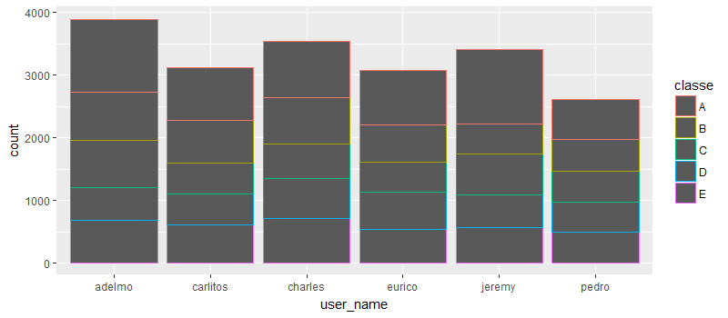
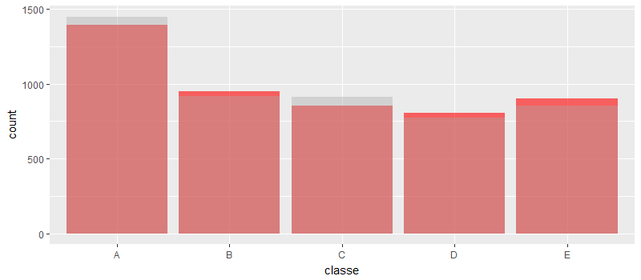

In this project, your goal will be to use data from accelerometers on the belt, forearm, arm, and dumbell of 6 participants.


```r
traindestfile = "./data/pml-training.csv"
testdestfile = "./data/pml-testing.csv"
if(!file.exists(traindestfile) || !file.exists(testdestfile)){
        download.file(url = "https://d396qusza40orc.cloudfront.net/predmachlearn/pml-training.csv", destfile = traindestfile)
        download.file(url = "https://d396qusza40orc.cloudfront.net/predmachlearn/pml-testing.csv", destfile = testdestfile)
}

training <- read.csv(traindestfile)
testing <- read.csv(testdestfile)
```

## Exploratory Data Analysis


```r
library(ggplot2)
g <- qplot(user_name, data = training, colour = classe)
g
```



Get the accelerometer data

```r
library(caret)
trainset <- training[,c(grep("accel", names(training)), 160)]

str(trainset)
```

```
'data.frame':	19622 obs. of  21 variables:
 $ total_accel_belt    : int  3 3 3 3 3 3 3 3 3 3 ...
 $ var_total_accel_belt: num  NA NA NA NA NA NA NA NA NA NA ...
 $ accel_belt_x        : int  -21 -22 -20 -22 -21 -21 -22 -22 -20 -21 ...
 $ accel_belt_y        : int  4 4 5 3 2 4 3 4 2 4 ...
 $ accel_belt_z        : int  22 22 23 21 24 21 21 21 24 22 ...
 $ total_accel_arm     : int  34 34 34 34 34 34 34 34 34 34 ...
 $ var_accel_arm       : num  NA NA NA NA NA NA NA NA NA NA ...
 $ accel_arm_x         : int  -288 -290 -289 -289 -289 -289 -289 -289 -288 -288 ...
 $ accel_arm_y         : int  109 110 110 111 111 111 111 111 109 110 ...
 $ accel_arm_z         : int  -123 -125 -126 -123 -123 -122 -125 -124 -122 -124 ...
 $ total_accel_dumbbell: int  37 37 37 37 37 37 37 37 37 37 ...
 $ var_accel_dumbbell  : num  NA NA NA NA NA NA NA NA NA NA ...
 $ accel_dumbbell_x    : int  -234 -233 -232 -232 -233 -234 -232 -234 -232 -235 ...
 $ accel_dumbbell_y    : int  47 47 46 48 48 48 47 46 47 48 ...
 $ accel_dumbbell_z    : int  -271 -269 -270 -269 -270 -269 -270 -272 -269 -270 ...
 $ total_accel_forearm : int  36 36 36 36 36 36 36 36 36 36 ...
 $ var_accel_forearm   : num  NA NA NA NA NA NA NA NA NA NA ...
 $ accel_forearm_x     : int  192 192 196 189 189 193 195 193 193 190 ...
 $ accel_forearm_y     : int  203 203 204 206 206 203 205 205 204 205 ...
 $ accel_forearm_z     : int  -215 -216 -213 -214 -214 -215 -215 -213 -214 -215 ...
 $ classe              : Factor w/ 5 levels "A","B","C","D",..: 1 1 1 1 1 1 1 1 1 1 ...
```
We see that some variables are mostly NA. Hence we can choose to ignore them and use the rest of the variables to make our models. Therefore we leave out the following:

1. var_total_accel_belt
2. var_accel_arm
3. var_accel_dumbbell
4. var_accel_forearm

Also looking at the names we can see that they are some sort of variable component of the total acceleration measurements of the
various accelerometers. We can probably safely ignore them

```r
# removing the NA variables
grep("var_accel", names(trainset))
```

```
[1]  7 12 17
```

```r
trainset <- trainset[, -c(grep("var_total_accel", names(trainset)), grep("var_accel", names(trainset)))]
str(trainset)
```

```
'data.frame':	19622 obs. of  17 variables:
 $ total_accel_belt    : int  3 3 3 3 3 3 3 3 3 3 ...
 $ accel_belt_x        : int  -21 -22 -20 -22 -21 -21 -22 -22 -20 -21 ...
 $ accel_belt_y        : int  4 4 5 3 2 4 3 4 2 4 ...
 $ accel_belt_z        : int  22 22 23 21 24 21 21 21 24 22 ...
 $ total_accel_arm     : int  34 34 34 34 34 34 34 34 34 34 ...
 $ accel_arm_x         : int  -288 -290 -289 -289 -289 -289 -289 -289 -288 -288 ...
 $ accel_arm_y         : int  109 110 110 111 111 111 111 111 109 110 ...
 $ accel_arm_z         : int  -123 -125 -126 -123 -123 -122 -125 -124 -122 -124 ...
 $ total_accel_dumbbell: int  37 37 37 37 37 37 37 37 37 37 ...
 $ accel_dumbbell_x    : int  -234 -233 -232 -232 -233 -234 -232 -234 -232 -235 ...
 $ accel_dumbbell_y    : int  47 47 46 48 48 48 47 46 47 48 ...
 $ accel_dumbbell_z    : int  -271 -269 -270 -269 -270 -269 -270 -272 -269 -270 ...
 $ total_accel_forearm : int  36 36 36 36 36 36 36 36 36 36 ...
 $ accel_forearm_x     : int  192 192 196 189 189 193 195 193 193 190 ...
 $ accel_forearm_y     : int  203 203 204 206 206 203 205 205 204 205 ...
 $ accel_forearm_z     : int  -215 -216 -213 -214 -214 -215 -215 -213 -214 -215 ...
 $ classe              : Factor w/ 5 levels "A","B","C","D",..: 1 1 1 1 1 1 1 1 1 1 ...
```

## Testing tree algorithm

```r
set.seed(33833)
inTrain <- createDataPartition(y=trainset$classe,
                              p=0.75, list=FALSE)
modeltrainset <- trainset[inTrain, ]
modeltestset <- trainset[-inTrain, ]

mf1 <- train(classe ~ ., method = "rpart", data = modeltrainset, na.action = na.pass)
confusionMatrix(predict(mf1, modeltestset),modeltestset$classe)$overall[1]
```

```
 Accuracy 
0.4208809 
```
* Clearly the accuracy is pretty low

## Testing random forest

* Here we will do a principle component analysis with a threshold of 0.8 to account for 80 percent of the variation. 
* This has been done to reduce the time taken for the algorithm to run on this large dataset. 
* We will also use *cross validation* using the train control method


```r
ctrl <- trainControl(preProcOptions = list(thresh = 0.8), method = "cv")
mf2 <- train(classe ~ ., method = "rf", data = modeltrainset, preProcess="pca", trControl = ctrl)

confusionMatrix(predict(mf2, modeltestset), modeltestset$classe)$overall[1]
```

```
 Accuracy 
0.8203507 
```
We can see that the accuracy has increased considerably by doing PCA and then using random forest to train the model


```r
library(ggplot2)
predict2 <- predict(mf2, modeltestset)

predictionDF <- data.frame(classe = predict2)
testdf <- data.frame(classe = modeltestset$classe)

g <- ggplot(testdf, aes(classe)) + geom_histogram(data = testdf, fill = "red", stat = "count", alpha = 0.6) + geom_histogram(data = predictionDF, stat = "count", alpha = 0.4, fill = "darkgray")
g
```



## Next we will try stacking the models
* NOTE: Can possibly lead to overfitting the model on the training set.

```r
pr1 <- predict(mf1, modeltestset)
pr2 <- predict(mf2, modeltestset)

prdf <- data.frame(pr1, pr2, classe = modeltestset$classe)

combfit <- train(classe ~ ., method="rf", data=prdf, trControl = trainControl(method = "cv"))

confusionMatrix(predict(combfit, modeltestset), modeltestset$classe)$overall[1]
```

```
Accuracy 
0.824429 
```

The accuracy seems to have improved marginally.

We can safely say that based on the results that the model fit trained using random forest can reasonably predict on the test data.

## Final result for the quiz

```r
predict(mf2, testing)
```

```
 [1] B A B A A E D B A A B C C A A B A B B B
Levels: A B C D E
```

